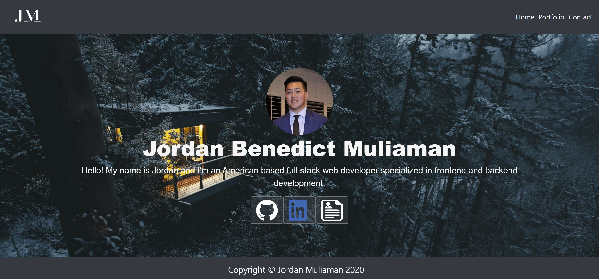

# React Portfolio

## Description
This portfolio is built using [React](https://reactjs.org/) and [reactstrap](https://reactstrap.github.io/). It features the [homepage](https://jmuliaman97.github.io/), [portfolio](https://jmuliaman97.github.io/portfolio) and [contact](https://jmuliaman97.github.io/contact). The portfolio also include links to [Github](https://github.com/jmuliaman97), [Linkedin](https://www.linkedin.com/in/jordan-muliaman/) and my resume. 

## Questions

Name: Jordan Muliaman
Email: jordan.muliaman@gmail.com